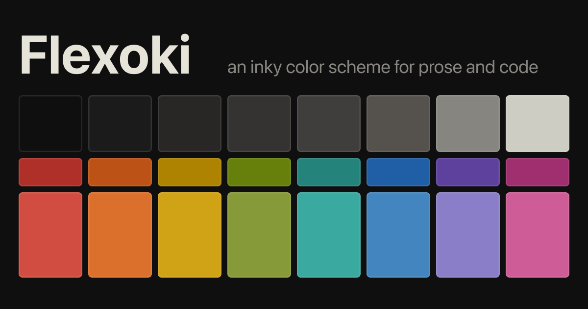
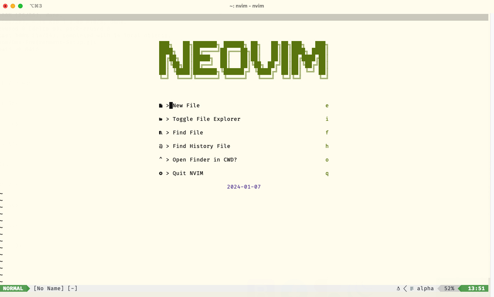
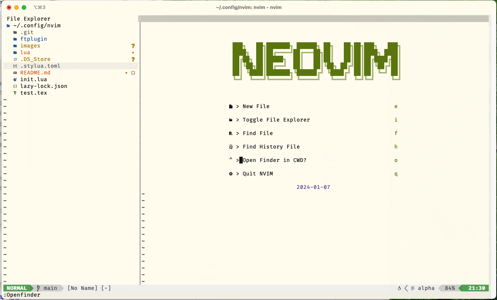
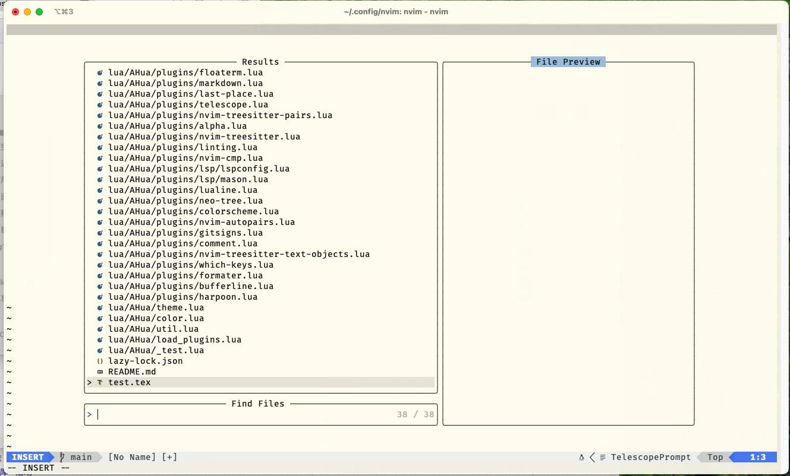
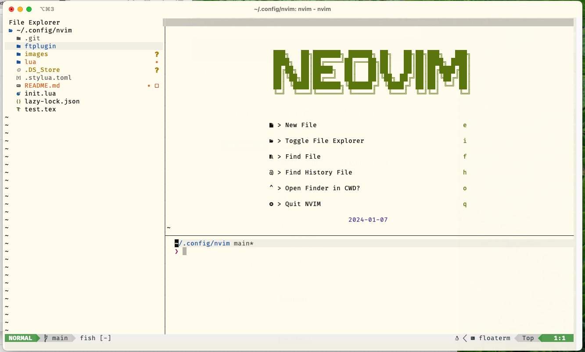

# Dev Environment Set Up

> Author: AHua  
> Update Date 2024-01-06  

## Terminal
## Shell

#### fish key mapping

[Fish shared-bindings](https://fishshell.com/docs/current/interactive.html#shared-bindings) 
- `TAB` complete the token.
- `Ctrl-P` previous command history contain the prefix.
- `Ctrl-N` next command history contain the prefix.
- `Ctrl-U` delete from beginning of the line to cursor,
- `Ctrl-F` accept the suggestion.
- `Ctrl-V` paste from clipboard,
- `Ctrl-L` clear the screen.

#### Set http proxy for the command line.

```bash
set --export https_proxy               http://127.0.0.1:7890
set --export http_proxy                http://127.0.0.1:7890 
set --export all_proxy                 socks5://127.0.0.1:7890
```
#### Fish plugin

Fish prompt theme [Pure](https://github.com/pure-fish/pure) 


## Neovim

### Directory structure

```text
.
|-- README.md
|-- init.lua
|-- ftplugin
|   `-- floaterm.lua
|-- lua
|   `-- AHua
|       |-- config      \\ Basic Config
|       |-- plugins     \\ Plugin Config
|       |-- _test.lua
|       |-- color.lua
|       |-- load_plugins.lua
|       |-- theme.lua
|       `-- util.lua
|-- lazy-lock.json      \\ Lazy use for plugin version control


```

### Basic settings and key mappings

Key Mappings
```text
<leader>i       Change in word
<leader>;       Command line
<leader>w       Window command prefix
<leader>q       Close window
a               Append at end of line
A               Append after word
J               Move up fast
K               Move down fast
<leader>e       Go to last buffer
<cr>            Go to line end
U               Undo
<c-v>           Paste from system clipboard

w               Move to next woed begin
e               Move to next word end
b               Move to prev word begin
gE              Move to prev word end

```

User Command
```text
AHuaTest        Source lua test file
CopyToSys       Copy from vim register to system clipboard
```

### Plugin Manager

### Colorscheme

 
[Flexoki](https://github.com/kepano/flexoki) 

### Appearance

 

Statusline [lualine.nvim](https://github.com/nvim-lualine/lualine.nvim)  
Bufferline [bufferline.nvim](https://github.com/akinsho/bufferline.nvim)  
Entry [alpha.nvim](https://github.com/goolord/alpha-nvim) 

### File Tree

 
[neo-tree](https://github.com/nvim-neo-tree/neo-tree.nvim) 

neotree key mappings
```text
<leader>t       Open file tree
<leader>sb      Open buffer
<leader>sg      Open git status
```

### Telescope

 
[telescope](https://github.com/nvim-telescope/telescope.nvim) 

telescope key mappings
```text
<leader>f       Fuzzy find files in cwd
<leader>so      Fuzzy find recent files
<leader>sl      Find string in cwd
<leader>sj      Find string under cursor in cwd
<leader>sk      Telescope builtin
```
### LSP Plugins

[lspconfig](https://github.com/neovim/nvim-lspconfig) 
[mason](https://github.com/williamboman/mason.nvim) 
[comformer](https://github.com/stevearc/conform.nvim) 
[linting](https://github.com/mfussenegger/nvim-lint) 

### Treesitter

[Treesitter text object](https://github.com/nvim-treesitter/nvim-treesitter-textobjects)  
Config text object
```text
\\ select objects
a=    @assignment.outer
i=    @assignment.inner
l=    @assignment.lhs
r=    @assignment.rhs

a:    @property.outer
i:    @property.inner
l:    @property.lhs
r:    @property.rhs

aa    @parameter.outer
ia    @parameter.inner

ai    @conditional.outer
ii    @conditional.inner

al    @loop.outer
il    @loop.inner
af    @call.outer
if    @call.inner
am    @function.outer
im    @function.inner
ac    @class.outer
ic    @class.inner

\\ move go to next start

]a    @parameter.outer

]f    @call.outer
]m    @function.outer
]c    @class.outer
]i    @conditional.outer
]l    @loop.outer
```

### Complete plugin cmp

[cmp](https://github.com/hrsh7th/nvim-cmp) 

key mappings
```text
<Tab>       Move to next
<S-Tab>     Move to prev
<C-b>       Scroll back
<C-f>       Scroll forward
<C-Space>   Complete
<C-e>       Completion abort
<CR>        Confirm
<c-p>       Snippet jump prev
<c-n>       Snippet jump next
```

### Terminal

 
[floaterm](https://github.com/voldikss/vim-floaterm) 

floaterm settings
```lua
vim.g.floaterm_autoinsert = false
vim.g.floaterm_wintype = "split"
vim.g.floaterm_position = "rightbelow"
vim.g.floaterm_height = 0.3

-- floaterm buffer set 
opt.number = false -- shows absolute line number on cursor line (when relative number is on)
opt.relativenumber = false -- show relative line numbers

```
key mappings
```text
<leader><cr>    Send current to Terminal
.               Toggle floaterm
<esc>           Exit Terminal to normal mode
<leader>n       New Terminal
q               Hide Terminal
X               Kill Terminal
H               Prev Terminal
L               Next Terminal

```
### Next & Prev
use `;` & `,` to repeat move and oppsite.

```lua
local ts_repeat_move = require("nvim-treesitter.textobjects.repeatable_move")
local next_hunk_repeat, prev_hunk_repeat = ts_repeat_move.make_repeatable_move_pair(gs.next_hunk, gs.prev_hunk)

```

```text
f       forward search in line
]b      Next buffer
]h      Next git hunk
]q      Next quickfix list
]d      Next error

]f      Next function call
]m      Next method
]a      Next argument

```

### Other Useful Plugins

- [comment.nvim](https://github.com/numToStr/Comment.nvim) make comment  
- [gitsigns.nvim](https://github.com/lewis6991/gitsigns.nvim) show git sign  
- [last-place.nvim](https://github.com/ethanholz/nvim-lastplace) go to last edit postion  
- [harpoon.nvim](https://github.com/ThePrimeagen/harpoon) mark file  
- [which-key.nvim](https://github.com/folke/which-key.nvim) show key mappings  


## Git

### settings

```git
[user]
  name = ""
  email = ""
[alias]
  lg = "log --color --graph --pretty=format:'%Cred%h%Creset -%C(yellow)%d%Creset %s %Cgreen(%cr) %C(bold blue)<%an>%Creset' --abbrev-commit"
  last = "log -1"
  co = "checkout"
  cmm = "commit -m"
  br = "branch"
  unstage = "reset HEAD"
```

### Git command

```text
git push
git checkout
git branch
git log
git add
git commit
git reset
git reflog
```


